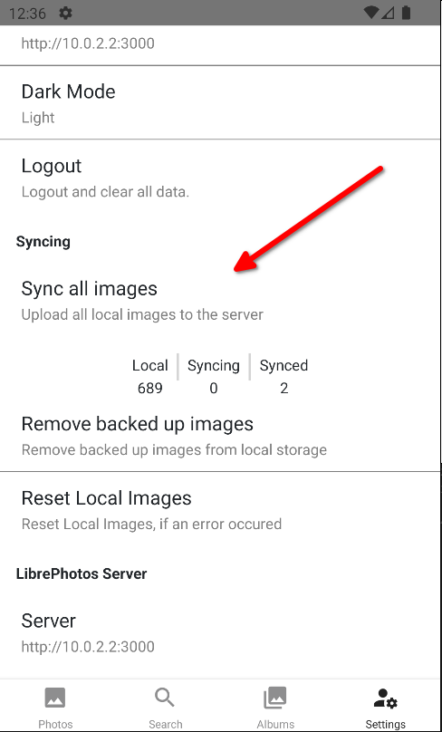
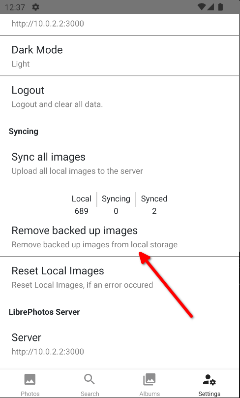

### Upload a single photo

Click on a local photo and click on the upload button in the top left corner.

### Prerequisites

Two things have to be in place before the mobile app can upload, and both are set up by an admin:

- **Uploads must be enabled** — the `Allow uploads` switch in the admin area has to be on (see [Activate / Deactivate the upload feature](#activate--deactivate-the-upload-feature) below).
- **Your account must have a Scan Directory** — an admin has to set a Scan Directory for your user, and that directory must exist inside the server container. See [How to Change Your Scan Directory](../../first-steps.md#how-to-change-your-scan-directory).

If the Scan Directory is missing or does not exist on the server, the upload is rejected. The mobile app currently does not surface this error: the photo simply stays unsynced. So if uploads never seem to complete, check with your admin that your Scan Directory is set correctly.

### What kinds of files are supported?

We accept all files that have a mime type of image.

### How does it work?

The upload process works in the following way:

- Check if file is on the server by comparing the hash `md5 + user_id`
- If it is, don't upload it
- If it isn't, upload it
- We upload files in 1MB chunks
- When a file finishes uploading, the server saves it under `scan folder + /uploads/web` and queues a background job for that one photo (thumbnails, metadata, captions, geolocation, album date and face detection) — no separate folder scan is triggered
- Mark the photo as synced

### Where are the files saved?

- If all the chunks are uploaded, we combine them into a single file and put them in your `scan folder + /uploads/web`

### Backup all photos

You can backup all photos by clicking on the `Sync all images` button in the settings.

### Delete synced photos

You can delete all backed up photos by clicking on the `Remove backed up images` button in the settings.
It works by checking if the photo is synced and if it is, it deletes it from your phone.

### Activate / Deactivate the upload feature

You can activate / deactivate by navigating as an admin to the admin area and clicking on the `Allow uploads` switch. This switch is the authoritative setting. The `ALLOW_UPLOAD` environment variable (set through `allowUpload` in `librephotos.env` for the Docker deployment) only supplies the initial default: once a value has been saved to the database — by toggling the switch, or by the first-time setup wizard — the stored setting wins and the environment variable is ignored. See [Environment variables](../../../installation/environment-variables.md).
