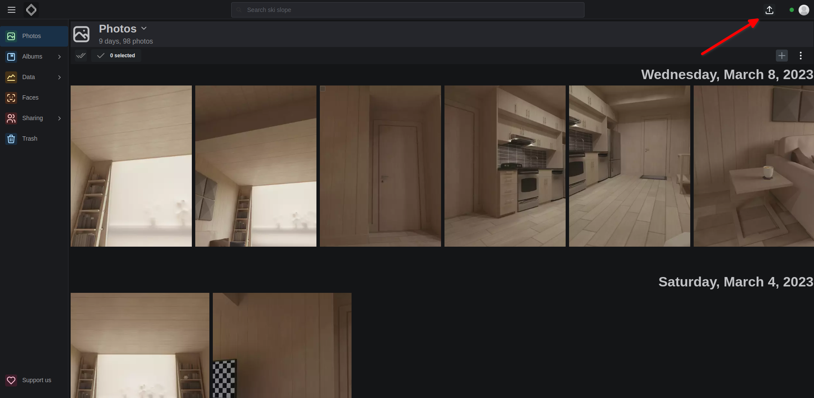
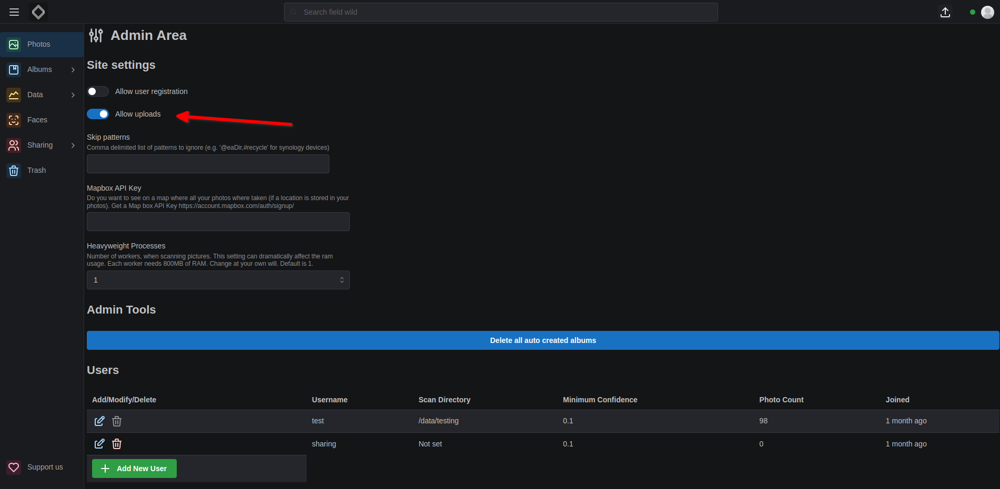

In the top right corner of the web interface, there is an upload button. Clicking it will open a file picker. You can select multiple files and upload them.

### What kinds of files are supported?

We accept all files that have a mime type of image or video.

### How does it work?

The upload process works in the following way:

- Check if file is on the server by comparing the hash `md5 + user_id`
- If it is, don't upload it
- If it isn't, upload it
- We upload files in 1MB chunks
- When each file finishes uploading, the backend registers that one photo and queues a background job chain for it (metadata and thumbnails, caption, geolocation, album dates, face extraction). No directory scan is triggered.

### Where are the files saved?

The upload behavior depends on whether the user has a scan directory configured:

#### When scan directory is properly configured:
- Files are saved to: `{scan_directory}/uploads/web/{filename}`
- This is the normal and expected behavior
- Files are stored in the mounted host directory and are persistent

#### When scan directory is NOT configured:
Uploads are blocked and nothing is written to disk.

- If your account has no scan directory set, the upload button is disabled and shows the tooltip *"Scan directory not configured - contact administrator"*.
- If a scan directory is set but the path does not exist on the server, the button stays active, but the upload is rejected once the final chunk is submitted.
- In both cases the API responds with HTTP 400 — `"Upload failed: No scan directory configured…"` or `"Upload failed: Scan directory '<path>' does not exist…"` — and no file is saved.

### Prerequisites for upload

To use the upload feature properly, you **must** have:

1. **Upload feature enabled**: Turn on `Allow uploads` in the admin area. Docker Compose users can pre-enable it by adding `allowUpload=true` to their `.env` before the first start — Compose passes it to the backend as `ALLOW_UPLOAD` (note the variable in `.env` is `allowUpload`, not `ALLOW_UPLOAD`)
2. **Scan directory configured**: Every user must have a scan directory set up by an admin

### How to configure scan directory

1. **Admin users only**: Only admins can set scan directories for users
2. **Access admin panel**: Click on your avatar (top right) → `Admin Area`
3. **Set scan directory**: Manually set the `Scan Directory` for each user
4. **Verify path**: The directory must exist and be accessible to the container

### Activate / Deactivate the upload feature

You can activate / deactivate by navigating as an admin to the admin area and clicking on the `Allow uploads` switch. This switch is the authoritative setting. The `ALLOW_UPLOAD` environment variable (set through `allowUpload` in your `.env` for the Docker Compose deployment) only supplies the initial default: once a value has been saved to the database — by toggling the switch, or by the first-time setup wizard — the stored setting wins and the environment variable is ignored.

### Scanning uploaded photos

After upload, you can scan the uploaded photos in two ways:

1. **Automatic scanning**: The upload process automatically triggers processing for the uploaded photo
2. **Manual scanning**: You can manually scan all uploaded photos by going to the Library page and clicking the scan button

### Troubleshooting

#### Upload button is greyed out
**Cause**: Your account has no scan directory configured. Hovering the button shows *"Scan directory not configured - contact administrator"*.
**Solution**: Ask an admin to set your scan directory (see [How to configure scan directory](#how-to-configure-scan-directory)).

#### Upload fails with "Scan directory does not exist"
**Cause**: The configured scan directory path is not present inside the backend container.
**Solution**: Check that the path matches the `${scanDirectory}:/data` bind mount in your compose file, and that the directory exists on the host.

#### Uploaded files disappear after container restart
**Cause**: The data root is not backed by a host directory. A scan directory has to live inside the backend's data root (`/data` by default) — anything outside it is rejected with *"Scan directory must be inside the data root."* — so the upload itself succeeds, but if `/data` is not bind-mounted, everything written there lives only in the container's filesystem and is lost when the container is recreated.
**Solution**: Make sure your compose file mounts a host directory at `/data` (the `${scanDirectory}:/data` line on the `backend` service) and that `scanDirectory` in your `.env` points at a real, persistent path on the host.

#### Upload fails with permission errors
**Cause**: The container doesn't have write permissions to the scan directory.
**Solution**: Check the directory permissions and ensure the container can write to the mounted directory.

#### Upload button not visible
**Cause**: Upload feature is disabled.
**Solution**: Toggle `Allow uploads` on in the admin area. Note that the `allowUpload` environment variable only supplies the *default* value: once the setting has been saved from the admin area or the first-run setup wizard, the value lives in the database and changing the env var has no effect.
